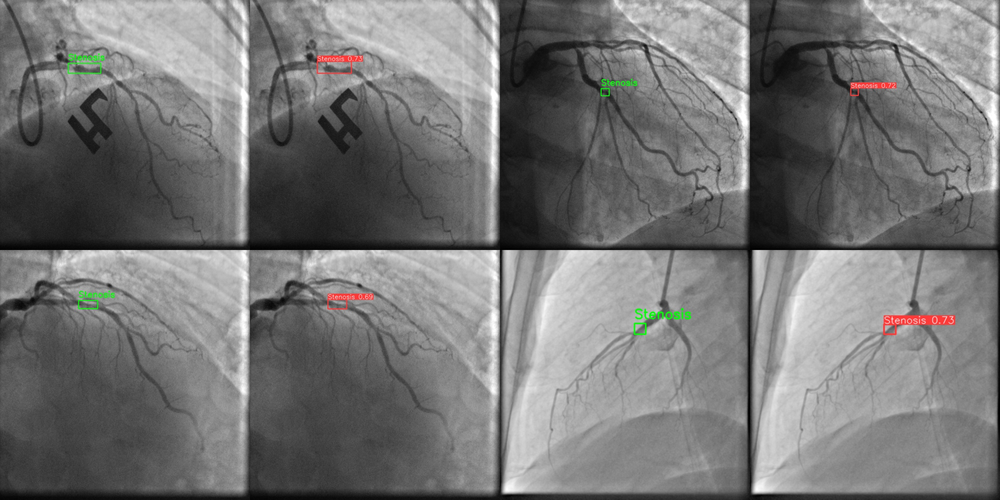

# Detect Coronary Artery Stenosis using YOLOv8

## Overview
This project focuses on detecting coronary artery stenosis in real-time using the YOLOv8 neural network model. Inspired by the paper "Real‑time coronary artery stenosis detection based on modern neural networks" we aim to improve the detection performance by integrating the latest advancements in object detection.

## Methodology
We utilized YOLOv8, a state-of-the-art object detection model, to detect coronary artery stenosis. Our approach includes training and evaluating the model on a dataset of coronary angiograms, and comparing its performance with several established neural networks such as SSD MobileNet, Faster-RCNN, and RFCN.

## Results
We evaluated the models using various metrics, including mean Average Precision (mAP) at different thresholds, F1 score, batch size, input size, number of parameters, mAP at 0.5 IoU threshold, and inference time. The results are summarized in the table below:

| Model Name            | mAP@[0.5-0.95] | F1  Score | Batch Size | Input Size | Number of params | mAP@0.5 | Inference Time (ms) |
|-----------------------|----------------|-----------|------------|------------|------------------|---------|--------------------|
| SSD MobileNet V1      | 32             | 0.72      | 4          | 640        | 4.2              | 69      | 43                 |
| SSD MobileNet V2      | 22             | 0.80      | 2          | 300        | 6.1             | 83      | 26                 |
| SSD ResNet-50 V1      | 35             | 0.73      | 2          | 640        | 25.6             | 76      | 61                 |
| Faster-RCNN ResNet-50 V1 | 30         | 0.88      | 1          | 600        | 25.6             | 92      | 98                 |
| RFCN ResNet-101 V2    | 30             | 0.96      | 1          | 600        | 44.7             | 94      | 99                |
| Faster-RCNN ResNet-101 V2 | 32        | 0.96      | 1          | 600        | 44.7             | 94      | 118                |
| Faster-RCNN Inception ResNet V2 | 37   | 0.94      | 1          | 600       | 55.9             | 95       | 363                |
| Faster-RCNN NASNet    | -              | 0.82      | 1          | 1200       | 88.9             | -       | 880                |
| YOLOv8                | 50.7           | 0.98      | 64         | 640        | 3.1              | 98      | 4                  |

## Sample Output
Below is a sample output image showcasing the bounding boxes detected by YOLOv8. The ground truth bounding boxes are displayed in green, while the YOLOv8 predicted bounding boxes are displayed in red.

## Conclusion
YOLOv8 demonstrates superior performance in detecting coronary artery stenosis with a higher mAP and F1 score compared to other models. Its faster inference time also makes it suitable for real-time applications.

## References
- "Real‑time coronary artery stenosis detection based on modern neural networks"